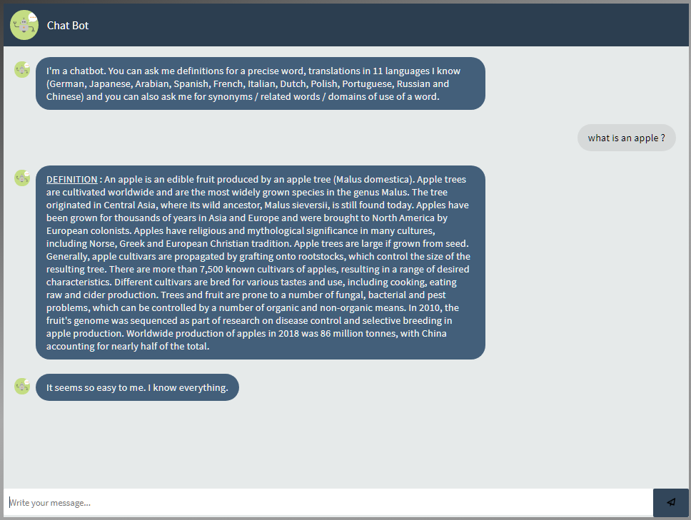
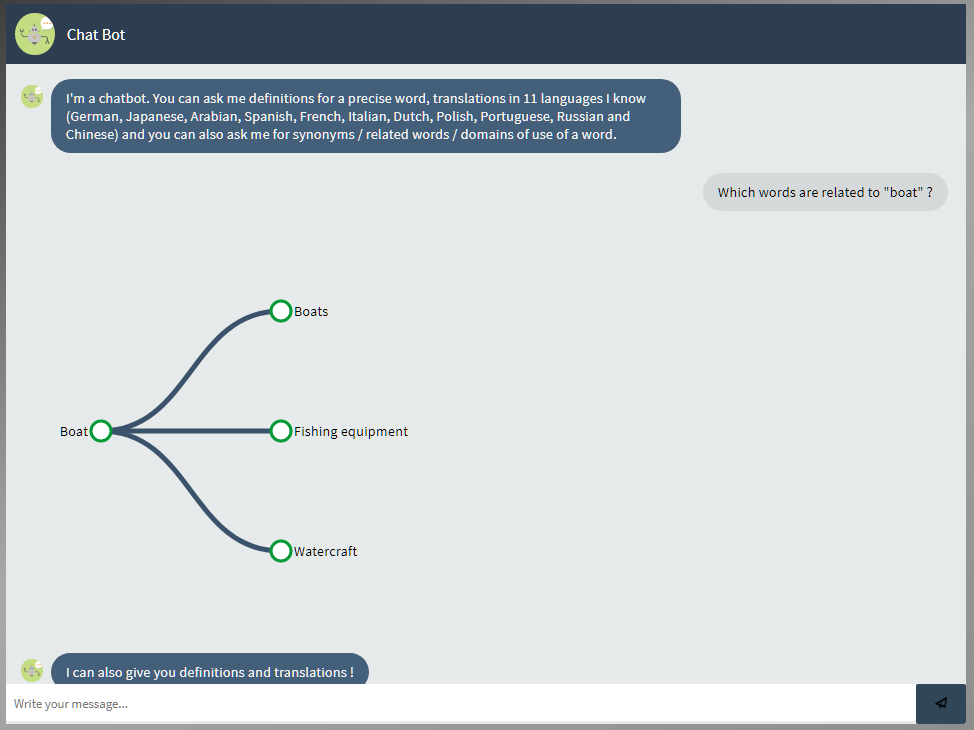
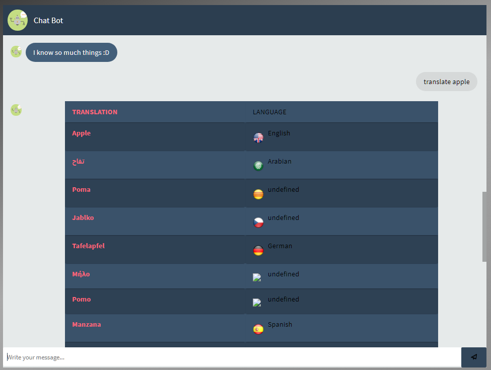

# Checksem Chatbot
Building a chatbot from scratch thanks to RASA NLU. Most consequent project at the Institute of Technology of Dijon

The purpose was to build a smart bot that would be able to answer to specific questions about giving word's :
- definitions
- translations in many languages
- related words / synonyms.

- This bot first queries an NLU service (RASA NLU in this repo, but the online version http://chatbot.dorian-naaji.fr/ queries LUIS.AI)
- According to the NLU service response, the bot will query [DBPEDIA](dbpedia.org/sparql) with the SPARQL syntax
- Finally, the answer will be built and sent to the user.

With not much experience in Software Development / Engineering, my team and I still did a great job for beginners. It was a nice experience to build a chatbot from scratch.
Nevertheless, the actual code is not really usable at it is, and is a bit spaghetti. If you need any help at setting up a chatbot, I'm sure there's nice websites and tutorials over the web.

# Showcase

_Definition of 'apple'_

_Words related to 'boat'_

_Translation of 'apple'. Some UI components are quite buggy !_ 😅
